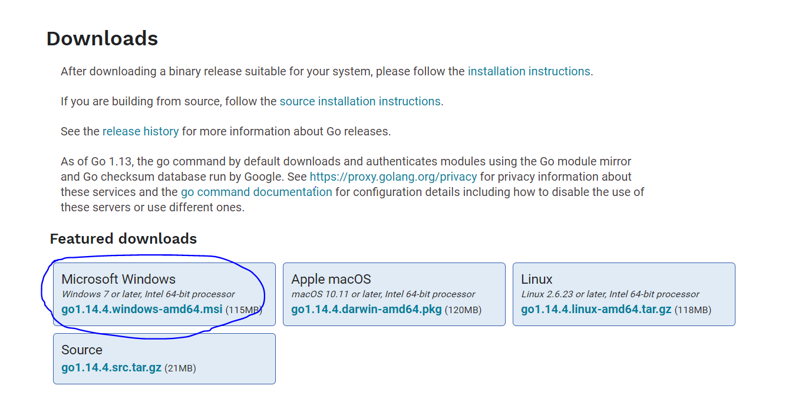
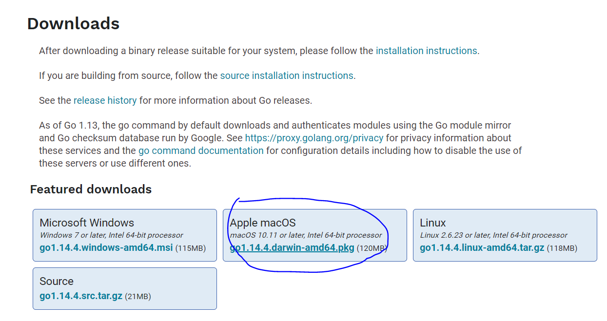
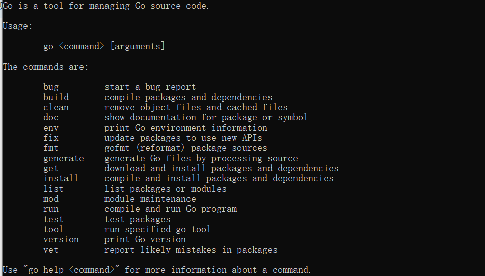
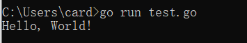
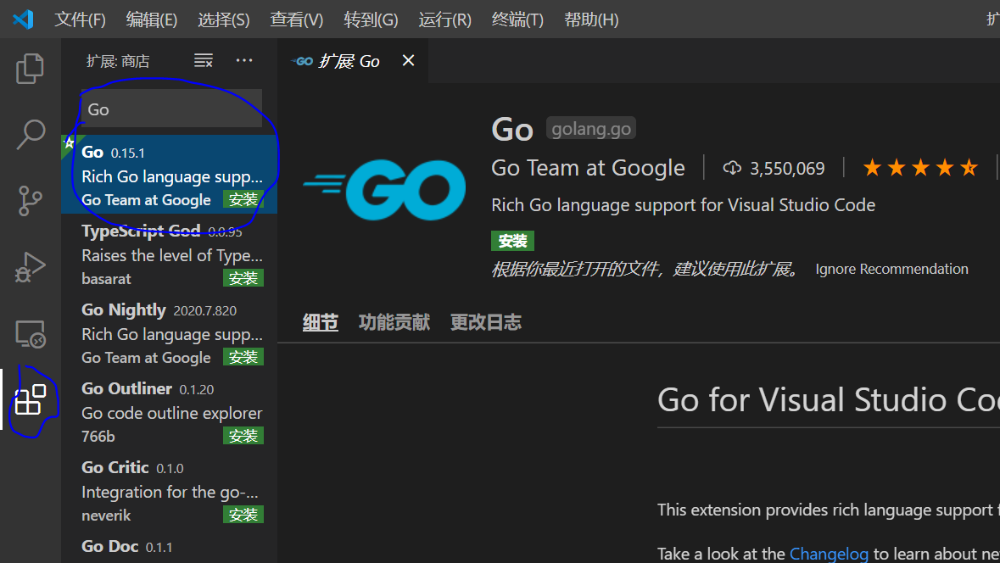

## 初识Go

### Go简介

#### Go的历史

1. 上个世纪70年代Ken Thompson和Dennis M. Ritchie合作发明了UNIX操作系统同时Dennis M. Ritchie发明了C语言。
2. 2007年的Robert Griesemer，Rob Pike和Ken。 Thompson三位大牛在Google公司开始编写和设计Go语言。
3. 2009年Go正式宣布推出，版本1.0在2012年3月发布。
4. 版本1.5 新 GC 算法，实现并发标记和清理，增加控制器和辅助回收等
5. 版本1.11 实验性启用版本和依赖管理 Modules，替代 GOPATH


#### Go的优缺点

1. **优点**

- 简单高效，Go继承了C语言，但是语法更加简洁，可以直接编译成二进制文件执行，内置虚拟机运行速度快。
- 并发支持好，Go独特的使用CSP并发模型，简单来说就是“不要以共享内存的方式来通信，相反，要通过通信来共享内存。”
- 静态语言编译时有类型检测，同时提供动态语言的特性，例如支持匿名函数和闭包。
- 内置强大的工具可以帮助开发人员编写的代码可读性和维护性更高。
- 强大的社区和生态系统

2. **缺点**

- 错误处理，如果有错误，Go需要函数返回错误。可能导致错误跟踪丢失和缺少有用的错误处理逻辑。
- 包管理，Go的包管理不完善，虽然Go 1.11版本加入了go mod解决一直存在的依赖管理的短板，但是一些老项目支持并不好


#### Go应用的领域

Go经过十几年的发展，已经广泛的用于各大公司和项目中，比较著名的项目如Docker、Consul、Kubernetes等

#### Go的环境搭建

> Go 支持Linux FreeBSD Windows Mac系统。

1. 下载

安装包的下载地址 https://golang.org/dl/ 打不开可以访问 https://golang.google.cn/dl/

2. Windows安装

打开下载页面，选择最新版本


下载完成，双击.msi文件安装一路选择Next直到安装完成。

3. Mac OS安装

打开下载页面，选择最新版本

下载完成，双击.pkg文件安装一路选择Next直到安装完成

4. 验证安装

Windows下打开cmd窗口（win 键+ R，输入 cmd 回车），在cmd窗口中输入go命令回车后，显示如下结果：


#### 第一个Go程序

在上面cmd窗口显示的目录中创建test.go文件，用文本编辑器打开，写入下面的代码
```
package main

import "fmt"

func main() {
   fmt.Println("Hello, World!")
}
```

然后在cmd窗口中执行
```
go run test.go
```
返回如下所示：



#### Go开发工具

Go的开发工具很多，推荐用的比较多的是：
- [Visual Studio Code](https://code.visualstudio.com/) 微软开源的免费代码编辑器，需要安装Go插件。
- [GoLand](https://www.jetbrains.com/go) GoLand是一个独立的IDE，专门用来开发Go功能十分强大，学生可以申请免费使用。

#### Visual Studio Code安装

打开 https://code.visualstudio.com/ 网站，下载安装Visual Studio Code，打开选择扩展搜索Go：
